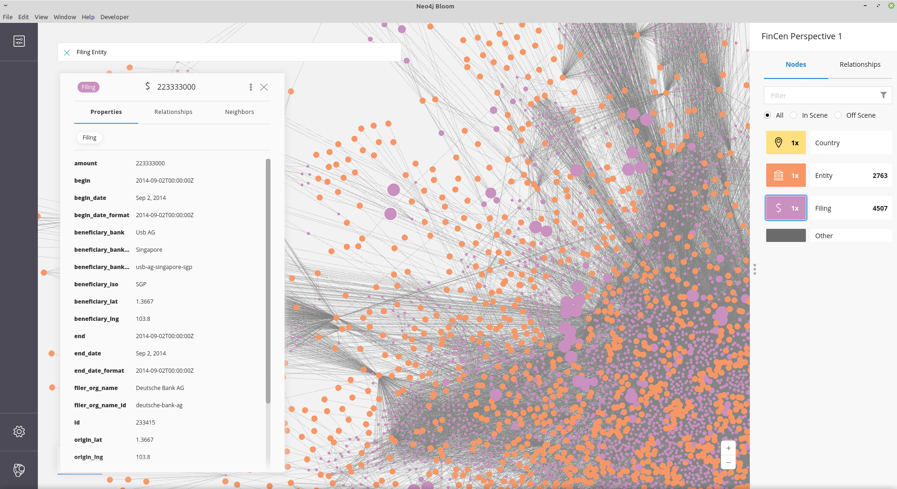
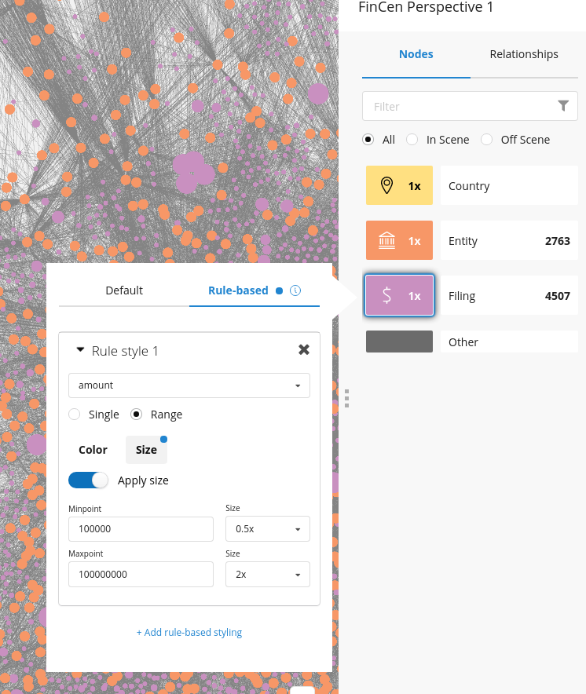

= ICIJ FinCen Dataset in Neo4j

== ICIJ Investigation

https://www.icij.org/investigations/fincen-files/

image::https://media.icij.org/uploads/2020/09/FinCEN_Files_ICIJ_1920px.jpg[width=600]

https://media.icij.org/uploads/2020/09/download_data_fincen_files.zip[*Files are available for download now*], via from: https://www.icij.org/investigations/fincen-files/download-fincen-files-transaction-data/

The download contains two CSV files with the same data as our JSON so I'll adjust the instructions below.

The files here were scraped from their site (https://www.icij.org/investigations/fincen-files/explore-the-fincen-files-data/[Explore The FinCen Data Files])

* https://www.icij.org/investigations/fincen-files/unchecked-by-global-banks-dirty-cash-destroys-dreams-and-lives/[Unchecked by global banks, dirty cash destroys dreams and lives]
* https://www.icij.org/investigations/fincen-files/global-banks-defy-u-s-crackdowns-by-serving-oligarchs-criminals-and-terrorists/[Global banks defy U.S. crackdowns by serving oligarchs, criminals and terrorists]
* https://www.icij.org/investigations/fincen-files/mining-sars-data/[How the ICIJ did the investiation]

.ICIJ used Neo4j and Linkurious again for their investigation
====
Lastly, ICIJ used charting databases (Neo4J and Linkurious) to visualize and explore the 400 FinCEN Files spreadsheets containing data on 100,000 transactions. 
These were some of the many tools to help rebuild the nuanced picture of a broken system. 

link:https://translate.google.com/translate?sl=auto&tl=en&u=https%3A%2F%2Fwww.eluniverso.com%2Fnoticias%2F2020%2F09%2F20%2Fnota%2F7983397%2Ffincen-files-revoltijo-informes-secretos-datos-condenatorios-sobre[(source)]
====

== Feedback and Contributions

All data is from the ICIJ Web-Visualization (JS file)

If you have fixes, or new ideas for queries, please send a pull request.

If something doesn't work, please create an issue.

== Pre-Populated Demo Databases

Demo Server with Neo4j Browser

* https://demo.neo4jlabs.com:7473 (user, password, database = fincen)

Sandbox

* Sandbox: https://10-0-1-92-35670.neo4jsandbox.com/browser/ (user, password = fincen)
* Bloom: https://10-0-1-92-35670.neo4jsandbox.com/browser/bloom/

=== Dump File

* link:fincen.dump[fincen.dump]
* To import into Neo4j Aura, use the "Upload Data" feature and drop the dump file
* For Neo4j Desktop, add the file to your project and use the "Imort Dump" from the 3-dots menu to import
* For manual import use `neo4j-admin load --from fincen.dump` in a stopped dmbs 
* For a running 4.x Enterprise dbms, you need to add `--database fincen` and then use `:use system` and `create database fincen` to activate it.

==  Import into Neo4j

* The scraped JSON files can be imported using link:fincen.cypher[`fincen.cypher`]
* The newly available CSV files can be imported using link:fincen_csv.cypher[`fincen_csv.cypher`]

=== Neo4j Sandbox (3 days)

. Start Blank Neo4j sandbox https://sandbox.neo4j.com/?usecase=blank-sandbox
. Open Neo4j Browser with the button
. Copy or drag&drop link:fincen.cypher[`fincen.cypher`] into the editor window on top and run with the triangular run button
. Explore with the sidebar, e.g. clicking on `Filing`
. To explore interactively and visually, use the blue "Open with Bloom" button and use "neo4j" as a username, and the password (under the key icon) as password to log in

=== Neo4j Desktop (local installation)

. Download Neo4j Desktop https://neo4j.com/download
. Install locally
. Create a new project and a new database, call it eg. FinCen, set a password and remember it
. Click on the three dots and then "Manage", click on "Plugins" and Install "APOC"
. Start the database with the Start Button (Triangle)
. Open Neo4j Browser (e.g. with the blue "Open" button) or by pressing cmd+k or ctrl+k and entering "Browser"
. Copy or drag&drop link:fincen.cypher[`fincen.cypher`] into the editor window on top and run with the triangular run button
. Explore with the sidebar, e.g. clicking on `Filing`
. To explore interactively and visually, select "Open with Bloom" from the blue "Open" button drop-down

=== Neo4j Aura Cloud Database

. Log into https://neo4j.com/cloud/aura (or directly https://console.neo4j.io)
. Put in your credit card information
. Create a new 1GB database
. Save the password
. Open Neo4j Browser with the button
. Copy or drag&drop link:fincen.cypher[`fincen.cypher`] into the editor window on top and run with the triangular run button
. Explore with the sidebar, e.g. clicking on `Filing`
. To explore interactively and visually, select "Open with Bloom" from the blue "Open" button drop-down

== Exploration

=== Neo4j Bloom

In Neo4j Bloom, you can e.g. search for `Filing Entity` in the search bar.

You can configure the sidebar with icons for Countries, Entities and filings

You can set a rule based styling e.g. for Filings, I did a size based on `amount` with the min `100000` to `0.5x` and the max `100000000` to `2x`

=== Example Queries

To run in Neo4j Browser just copy them into the editor on top and run with the triangular run button.

.Biggest Filings
[source,cypher]
----
MATCH (f:Filing)
RETURN f ORDER BY f.amount DESC LIMIT 10;
----

.Biggest Filing with participants
[source,cypher]
----
MATCH (f:Filing)
WITH f ORDER BY f.amount DESC LIMIT 10
MATCH (f)--(e:Entity)
RETURN *
----

.Entities with highest transaction volume
[source,cypher]
----
MATCH (e:Entity)--(f:Filing)
WITH e, round(sum(f.amount)) as total
WITH e, total ORDER BY total DESC LIMIT 10
OPTIONAL MATCH (e)-[:COUNTRY]-(c:Country)
RETURN e.name, c.name, total
----

.Money flows between banks
[source,cypher]
----
MATCH (source:Entity)<-[:ORIGINATOR]-(f:Filing)-[:BENEFITS]->(target:Entity)
WITH source, target, round(sum(f.amount)) as total ORDER BY total DESC LIMIT 10
RETURN source.name, target.name, total
----

